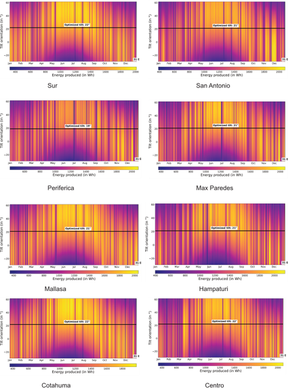

Colors:
#0000A3
#0067B3
#40B0DF
#FFD53D

# **ANÁLISIS TÉCNICO-ECONÓMICO DE LA INSTALACIÓN DE SISTEMAS FOTOVOLTAICOS CONECTADOS A LA RED EN CONSUMIDORES DOMICILIARIOS, GENERALES E INDUSTRIALES EN LA PAZ-BOLIVIA**

##  Autora: Fernanda Belen Nistahuz Marca 
### Contenido

1. ***Angulo Optimo para instalacion de Sistemas Fotovoltaicos***

2. ***Distribuciones por Macrodistrito por Categoria***

#### Angulo Optimo para instalacion de Sistems Fotovoltaicos
Para determinar el ángulo óptimo de inclinación en una instalación fija, se utilizan diferentes métodos y algoritmos que tienen en cuenta la ubicación geográfica y las características del sitio. Estos métodos buscan maximizar la captura de radiación solar durante todo el año, considerando la variación estacional del ángulo de incidencia solar. Utilizando datos climáticos y de irradiación solar específicos de la región, así como algoritmos de optimización, es posible calcular el ángulo de inclinación que maximiza la producción de energía a lo largo del año.

#### Distribuciones por Macrodistrito por Categoria

La distribución por macrodistritos estan realizados a partir de la base de datos de consumidores del municipio de La Paz, filtrando por categorias General e Industrial por cada macrodistrito, lastimosamente, no pudo realizarse el mismo filtrado para la categoria domiciliario debido a que las direcciones cargadas por la empresa distribuidora, tiene las direcciones en forma literal y con muchas variantes por sitio, lo que imposibilta la realización del filtrado.

